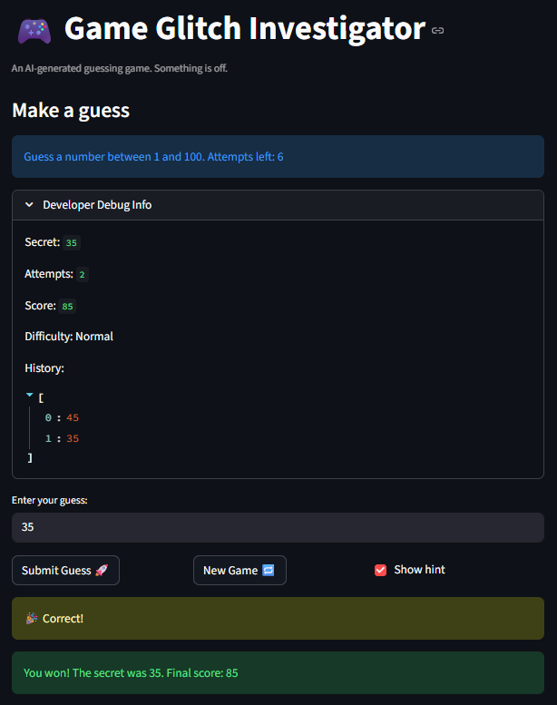
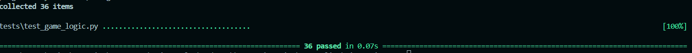

# 🎮 Game Glitch Investigator: The Impossible Guesser

## 🚨 The Situation

You asked an AI to build a simple "Number Guessing Game" using Streamlit.
It wrote the code, ran away, and now the game is unplayable. 

- You can't win.
- The hints lie to you.
- The secret number seems to have commitment issues.

## 🛠️ Setup

1. Install dependencies: `pip install -r requirements.txt`
2. Run the broken app: `python -m streamlit run app.py`

## 🕵️‍♂️ Your Mission

1. **Play the game.** Open the "Developer Debug Info" tab in the app to see the secret number. Try to win.
2. **Find the State Bug.** Why does the secret number change every time you click "Submit"? Ask ChatGPT: *"How do I keep a variable from resetting in Streamlit when I click a button?"*
3. **Fix the Logic.** The hints ("Higher/Lower") are wrong. Fix them.
4. **Refactor & Test.** - Move the logic into `logic_utils.py`.
   - Run `pytest` in your terminal.
   - Keep fixing until all tests pass!

## 📝 Document Your Experience

### Game Purpose

This is a number guessing game built with Streamlit. The player picks a difficulty (Easy: 1–20, Normal: 1–100, Hard: 1–200), is given a limited number of attempts, and tries to guess the secret number. After each guess the game tells you whether to go higher or lower. Your score starts at a maximum and decreases with each wrong guess. The game was intentionally shipped broken as a debugging exercise.

### Bugs Found

I found 9 bugs across game logic, state management, and display:

1. **Attempts started at 1** — the counter was initialized to 1 instead of 0, consuming one attempt before the player guessed anything
2. **Hints were reversed** — guessing too high told you to go higher, guessing too low told you to go lower
3. **New game button did not reset the game** — only `attempts` and `secret` were reset; `status`, `score`, and `history` were left stale, blocking play after a win or loss
4. **Range display was hardcoded to 1–100** — the in-game prompt always showed "Guess a number between 1 and 100" regardless of difficulty
5. **Game ended one attempt early** — a side effect of Bug 1; every difficulty effectively lost one usable guess
6. **Score was inconsistent** — "Too High" guesses on even-numbered attempts added 5 points instead of subtracting
7. **Type coercion on even attempts** — the secret was cast to `str` before being passed to `check_guess`, causing unreliable string comparison on every second guess
8. **Hard difficulty was easier than Normal** — Hard had range 1–50, Normal had 1–100, making Hard statistically easier to win
9. **New game generated a secret outside the difficulty range** — the reset hardcoded `random.randint(1, 100)` regardless of which difficulty was active

### Fixes Applied

All logic was moved from `app.py` into `logic_utils.py` and fixed there. Copilot Agent was used throughout to help identify bugs, write fixes, and generate tests.

| Bug | Fix |
|---|---|
| Attempts started at 1 | Changed initialization to `0` |
| Reversed hints | Swapped "Go HIGHER!" and "Go LOWER!" messages in `check_guess` |
| New game incomplete reset | Created `reset_game(low, high)` in `logic_utils.py` that resets all 5 state keys |
| Range hardcoded to 1–100 | Replaced hardcoded string with `{low}` and `{high}` variables |
| Game ended early | Fixed by Bug 1 fix |
| Inconsistent score | Removed even/odd attempt branch; both wrong guess types always subtract 5 |
| Type coercion | Removed the `str(secret)` cast; secret is always passed as an integer |
| Hard easier than Normal | Changed Hard range from 1–50 to 1–200 |
| New game wrong range | `reset_game` now takes `low, high` from `get_range_for_difficulty(difficulty)` |

Decimal inputs (e.g. `3.9`) were also discovered to silently truncate to `3`, which could cause a false win if the secret was `3`. Fixed by rejecting any input containing a `.` with "Please enter a whole number."

### AI Collaboration — Copilot Agent

I used Copilot Agent mode to help identify bugs in the original code, plan the refactor into `logic_utils.py`, generate the initial pytest suite, and suggest edge case inputs to test. One suggestion was misleading — Copilot claimed a "dead score calculation line" existed (two lines overwriting each other) when git history showed only one line ever existed. The formula change it suggested (`attempt_number - 1`) turned out to be correct game logic, but the stated justification was false. I verified every suggestion by checking the git history and running the game manually before accepting it.

## 📸 Demo

### Fixed Game — Winning Run

### pytest Results — 36 Tests Passing (Challenge 1: Advanced Edge-Case Testing)

